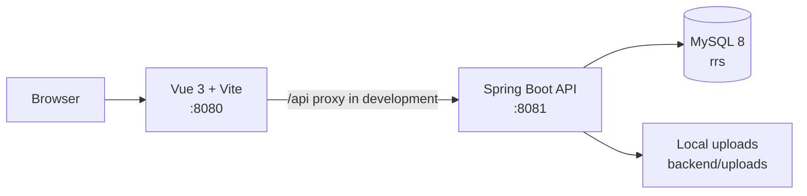

# Restaurant Ordering System

[简体中文](README.zh-CN.md) · [API reference](开发文档/06-接口文档.md) · [Architecture](开发文档/04-架构设计HLD.md)

A full-stack restaurant ordering system for customer ordering flows and restaurant administration. It provides a Vue 3 web interface, a Spring Boot REST API, MySQL persistence, local image uploads, and wallet-based **simulated** payment.

> This project is intended for learning and demonstrations. The built-in accounts, password, database password, and sample business data are not suitable for production use.

## Features

- Customer flows: register and sign in, browse dishes by category, cart, order placement, wallet recharge/payment, order history, refund application, favorites, reviews, profile, and messages.
- Administration: dashboard metrics, users and roles, dish categories/dishes/packages, restaurant tables, orders, refunds, wallet records, reviews, and system messages.
- Security and validation: BCrypt password hashes, JWT bearer authentication, role checks for administrator endpoints, validation DTOs, and image type/size/content checks.
- Data: MySQL schema and repeatable sample-data scripts, including approved dish image assets.

## Screenshots

| Dish catalogue | Administration dashboard |
| --- | --- |
|  |  |

| Dish management | Order management |
| --- | --- |
|  |  |

| User management | Profile |
| --- | --- |
|  |  |

## Architecture



The backend does not have an `/api` prefix. `/api` is only the Vite development proxy prefix and is removed before forwarding to the API.

## Tech stack

| Area | Technology |
| --- | --- |
| Frontend | Vue 3, TypeScript, Vite, Vue Router, Pinia, Element Plus, Axios |
| Backend | Java 21, Spring Boot 3.2.5, MyBatis-Plus, Druid, JJWT, Lombok |
| Database | MySQL 8+, UTF-8 (`utf8mb4` / `utf8mb4_bin`) |

## Quick start

### Prerequisites

- JDK 21
- Maven 3.9+
- Node.js 24+ with npm
- MySQL 8+

### 1. Initialize MySQL

The repository supplies a schema, repeatable hardening/migration scripts, approved sample dish assets, and two demo accounts. On PowerShell, run the following from the repository root:

```powershell
Get-Content -Raw backend/sql/init.sql | mysql --default-character-set=utf8mb4 -u root -proot
Get-Content -Raw backend/sql/20260725_hardening.sql | mysql --default-character-set=utf8mb4 -u root -proot rrs
Get-Content -Raw backend/sql/20260725_table_occupancy.sql | mysql --default-character-set=utf8mb4 -u root -proot rrs
Get-Content -Raw backend/sql/20260725_order_item_index.sql | mysql --default-character-set=utf8mb4 -u root -proot rrs
Get-Content -Raw backend/sql/20260725_add_rich_dishes.sql | mysql --default-character-set=utf8mb4 -u root -proot rrs
Get-Content -Raw backend/sql/20260725_dishes_cover_urls.sql | mysql --default-character-set=utf8mb4 -u root -proot rrs
```

`20260725_keep_admin_and_one_normal_user.sql` is an optional cleanup script for an existing development database; do not run it against data you need to keep.

### 2. Configure and start the backend

`backend/src/main/resources/application-local.yml` uses the local demonstration database configuration `root` / `root`. Before starting, provide a unique JWT secret of at least 32 bytes; never commit a real secret.

```powershell
$env:JWT_SECRET = "replace-with-a-random-secret-of-at-least-32-bytes"
Set-Location backend
mvn spring-boot:run
```

The API listens on `http://localhost:8081`.

### 3. Start the frontend

Open a second terminal:

```powershell
Set-Location front
npm ci
npm run dev
```

Open `http://localhost:8080`. The development server proxies `/api` to the backend.

## Demo accounts

The initialization script creates public demonstration accounts with password `123456`:

| Role | Account |
| --- | --- |
| Administrator | `admin` |
| Customer | `zhouzhiruo` |

Change or remove these accounts before any non-demo deployment.

## Configuration

| Setting | Purpose | Safe public default |
| --- | --- | --- |
| `DB_USERNAME` | MySQL account | `root` |
| `DB_PASSWORD` | MySQL password | empty in `application.yml`; local demo file uses `root` |
| `JWT_SECRET` | JWT HS256 signing secret | required; no real value is tracked |
| `CORS_ALLOWED_ORIGINS` | Allowed browser origins | `http://localhost:8080` |
| `UPLOAD_BASE_URL` | Optional absolute upload URL prefix | empty (derive from request) |

## Documentation

- [Project overview and documentation index](开发文档/00-项目说明.md)
- [Product requirements](开发文档/01-PRD产品需求文档.md)
- [Page prototypes](开发文档/02-页面原型图.md)
- [Business flows](开发文档/03-业务流程图.md)
- [Architecture](开发文档/04-架构设计HLD.md)
- [Database ER model](开发文档/05-数据库ER图.md)
- [API reference](开发文档/06-接口文档.md)
- [Test cases](开发文档/07-测试用例.md)

## Verification

The following commands were run for this release preparation:

```powershell
Set-Location backend; mvn test
Set-Location front; npm run build
```

See the test-case document for manual coverage scenarios. Database-backed end-to-end tests require a locally initialized MySQL instance and are not bundled with the repository.

## Roadmap

- Integrate a real payment provider.
- Add automated backend and end-to-end tests.
- Add production deployment assets after they are tested in an appropriate environment.

## Contributing and support

Contributions are welcome. Please read [CONTRIBUTING.md](CONTRIBUTING.md), report reproducible defects through GitHub Issues, and use [SECURITY.md](SECURITY.md) for security concerns. General usage questions belong in GitHub Issues or Discussions.

## License

This project is released under the [MIT License](LICENSE).
