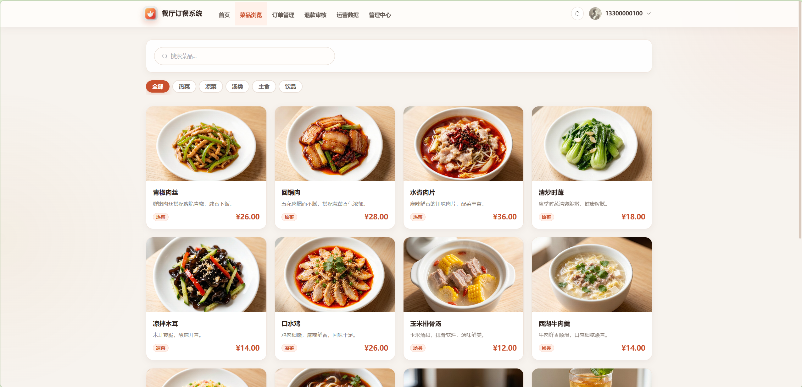
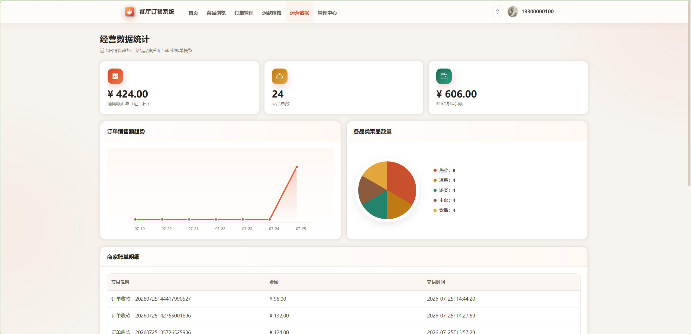
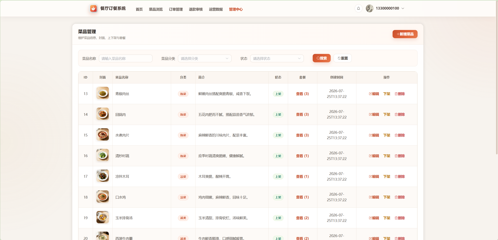
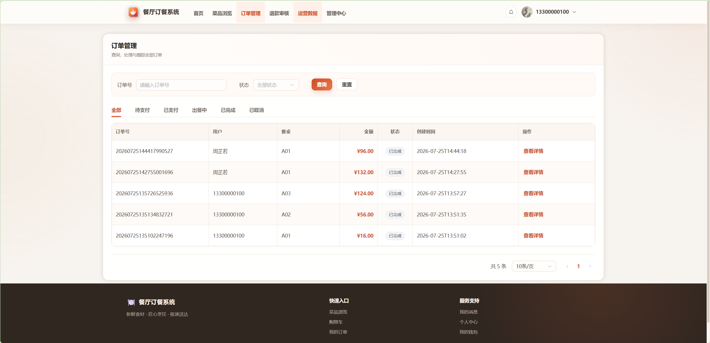
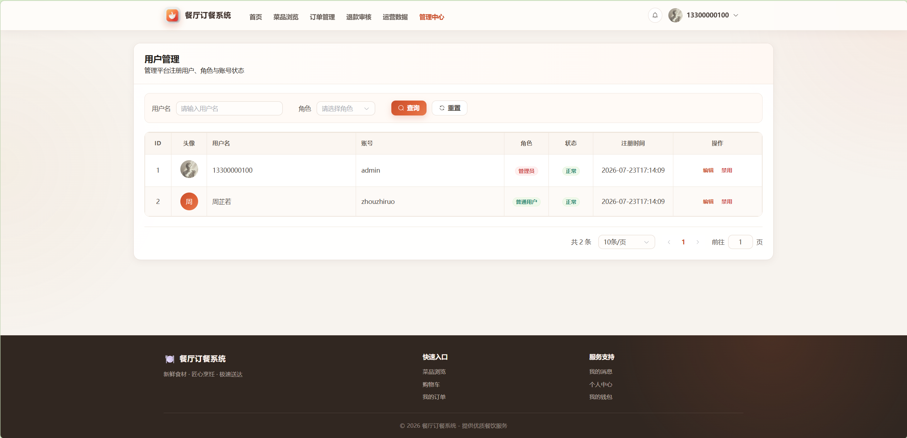
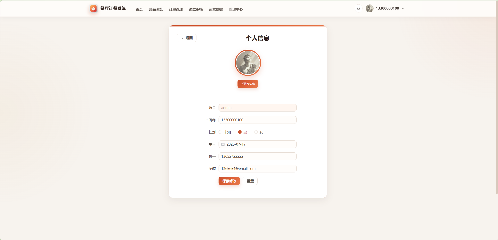
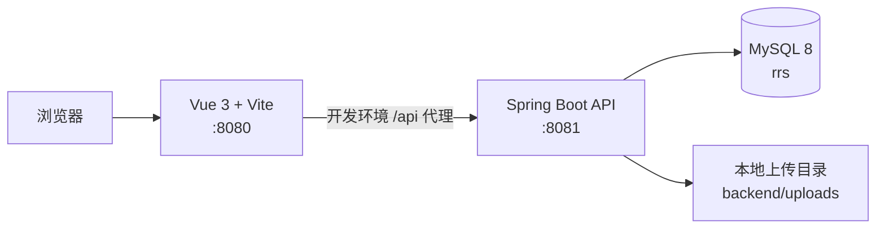

# 餐厅订餐系统

[English](README.md) · [接口文档](开发文档/06-接口文档.md) · [架构设计](开发文档/04-架构设计HLD.md)

一个面向顾客点餐流程与餐厅管理场景的前后端分离项目。项目提供 Vue 3 Web 界面、Spring Boot REST API、MySQL 数据持久化、本地图片上传，以及基于钱包的**模拟**支付。

> 本项目用于学习与演示。内置账号、密码、数据库密码和示例业务数据均不适合生产环境。

## 功能

- 用户端：注册登录、分类浏览菜品、购物车、下单、钱包充值与支付、订单查询、退款申请、收藏、评价、个人资料和消息通知。
- 管理端：经营数据、用户与角色、菜品分类/菜品/套餐、餐桌、订单、退款、钱包明细、评价和系统消息管理。
- 安全与校验：BCrypt 密码哈希、JWT Bearer 认证、管理员接口鉴权、DTO 参数校验，以及图片类型/大小/内容校验。
- 数据：MySQL 建表与可重复执行的样例数据脚本，包含经批准公开的菜品素材。

## 演示截图

| 菜品浏览 | 经营数据 |
| --- | --- |
|  |  |

| 菜品管理 | 订单管理 |
| --- | --- |
|  |  |

| 用户管理 | 个人信息 |
| --- | --- |
|  |  |

## 架构



后端接口本身不带 `/api` 前缀；`/api` 仅是 Vite 开发服务器使用的代理前缀，转发时会被移除。

## 技术栈

| 范围 | 技术 |
| --- | --- |
| 前端 | Vue 3、TypeScript、Vite、Vue Router、Pinia、Element Plus、Axios |
| 后端 | Java 21、Spring Boot 3.2.5、MyBatis-Plus、Druid、JJWT、Lombok |
| 数据库 | MySQL 8+，`utf8mb4` / `utf8mb4_bin` |

## 快速启动

### 环境要求

- JDK 21
- Maven 3.9+
- Node.js 24+ 与 npm
- MySQL 8+

### 1. 初始化 MySQL

仓库提供建表、加固/迁移、示例菜品与图片关联脚本。请在仓库根目录的 PowerShell 中依次执行：

```powershell
Get-Content -Raw backend/sql/init.sql | mysql --default-character-set=utf8mb4 -u root -proot
Get-Content -Raw backend/sql/20260725_hardening.sql | mysql --default-character-set=utf8mb4 -u root -proot rrs
Get-Content -Raw backend/sql/20260725_table_occupancy.sql | mysql --default-character-set=utf8mb4 -u root -proot rrs
Get-Content -Raw backend/sql/20260725_order_item_index.sql | mysql --default-character-set=utf8mb4 -u root -proot rrs
Get-Content -Raw backend/sql/20260725_add_rich_dishes.sql | mysql --default-character-set=utf8mb4 -u root -proot rrs
Get-Content -Raw backend/sql/20260725_dishes_cover_urls.sql | mysql --default-character-set=utf8mb4 -u root -proot rrs
```

`20260725_keep_admin_and_one_normal_user.sql` 只用于清理既有开发库中的测试账号；它会删除数据，不要在需要保留的数据上执行。

### 2. 配置并启动后端

`backend/src/main/resources/application-local.yml` 使用本机演示数据库配置 `root` / `root`。启动前必须提供至少 32 字节的随机 JWT 密钥，真实密钥绝不能提交到仓库：

```powershell
$env:JWT_SECRET = "替换为长度至少 32 字节的随机密钥"
Set-Location backend
mvn spring-boot:run
```

后端地址为 `http://localhost:8081`。

### 3. 启动前端

新开一个终端：

```powershell
Set-Location front
npm ci
npm run dev
```

访问 `http://localhost:8080`；开发服务器会把 `/api` 请求代理至后端。

## 演示账号

初始化脚本会创建以下可公开的演示账号，密码均为 `123456`：

| 角色 | 账号 |
| --- | --- |
| 管理员 | `admin` |
| 普通用户 | `zhouzhiruo` |

任何非演示部署前都应修改或删除这些账号。

## 配置项

| 配置 | 作用 | 安全的公开默认值 |
| --- | --- | --- |
| `DB_USERNAME` | MySQL 用户名 | `root` |
| `DB_PASSWORD` | MySQL 密码 | `application.yml` 为空；本地演示文件为 `root` |
| `JWT_SECRET` | JWT HS256 签名密钥 | 必填，仓库不保存真实值 |
| `CORS_ALLOWED_ORIGINS` | 允许的浏览器来源 | `http://localhost:8080` |
| `UPLOAD_BASE_URL` | 可选的上传文件绝对地址前缀 | 空（按请求地址生成） |

## 开发文档

- [项目说明与文档索引](开发文档/00-项目说明.md)
- [产品需求](开发文档/01-PRD产品需求文档.md)
- [页面原型](开发文档/02-页面原型图.md)
- [业务流程](开发文档/03-业务流程图.md)
- [架构设计](开发文档/04-架构设计HLD.md)
- [数据库 ER 模型](开发文档/05-数据库ER图.md)
- [接口文档](开发文档/06-接口文档.md)
- [测试用例](开发文档/07-测试用例.md)

## 验证

本次开源准备实际执行了以下命令：

```powershell
Set-Location backend; mvn test
Set-Location front; npm run build
```

手工测试场景见测试用例文档。依赖数据库的端到端测试需要本地初始化 MySQL，仓库未捆绑此类自动化测试。

## 路线图

- 接入真实支付服务。
- 增加后端与端到端自动化测试。
- 在完成真实环境验证后补充生产部署资产。

## 贡献与支持

欢迎贡献。请先阅读 [CONTRIBUTING.md](CONTRIBUTING.md)，可复现的问题请通过 GitHub Issues 反馈；安全问题请遵循 [SECURITY.md](SECURITY.md)。使用问题可通过 GitHub Issues 或 Discussions 交流。

## 许可证

本项目采用 [MIT License](LICENSE) 开源。
