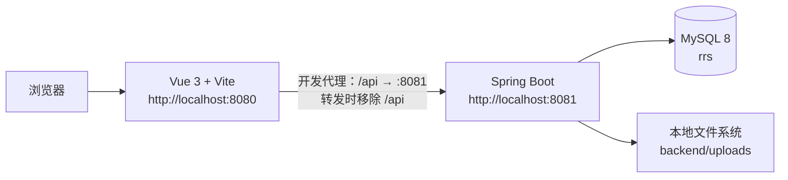

# 餐厅订餐系统：架构设计（HLD）

## 1. 文档信息

| 项目 | 内容 |
| --- | --- |
| 项目名称 | 餐厅订餐系统（Restaurant Ordering System） |
| 文档版本 | V1.1 |
| 更新日期 | 2026-07-25 |
| 架构类型 | 前后端分离的单体应用 |
| 适用范围 | 当前仓库的本地开发与学习演示环境 |

本文只描述仓库中已经存在的实现。Nginx、Docker、Redis、对象存储、消息队列、真实支付和多实例部署均未在本仓库实现，不能视为当前架构的一部分。

## 2. 运行架构



### 2.1 请求边界

- 浏览器在开发环境中请求 `/api/...`。
- `front/vite.config.ts` 将请求代理到 `http://localhost:8081`，并去掉 `/api` 前缀。
- 后端控制器的真实路径均以 `/user`、`/dishes`、`/orders` 等开头，不带 `/api` 前缀。
- 除登录、注册、上传资源和错误路径外，后端拦截器要求 `Authorization: Bearer <token>`。
- 管理员端点通过 `@AdminOnly` AOP 校验 `role = 2`；普通用户为 `role = 1`。

### 2.2 上传文件

上传接口只接受 JPG/JPEG/PNG，单个文件最大 5 MB，并校验图片内容和最大尺寸。文件写入后端工作目录下的 `uploads/`，经 `/uploads/**` 暴露。仓库只保留被示例 SQL 引用的菜品素材；运行时上传的其他文件不应提交。

## 3. 技术选型

| 层次 | 当前技术 | 证据 |
| --- | --- | --- |
| 前端 | Vue 3、TypeScript、Vite、Vue Router、Pinia、Element Plus、Axios | `front/package.json` |
| 后端 | Java 21、Spring Boot 3.2.5 | `backend/pom.xml` |
| 持久层 | MyBatis-Plus 3.5.5、MySQL Connector/J、Druid | `backend/pom.xml` |
| 认证 | JJWT 0.12.5、BCrypt（Spring Security Crypto） | `backend/pom.xml` 与 `JwtUtils` |
| 数据库 | MySQL；`rrs` / `utf8mb4` / `utf8mb4_bin` | `backend/sql/init.sql` |

## 4. 代码结构与职责

### 4.1 后端

```text
backend/src/main/java/com/kmbeast/
├── controller/   HTTP 路由与请求入口
├── service/      业务编排与事务边界
├── mapper/       MyBatis-Plus 查询与数据访问
├── pojo/
│   ├── dto/      请求参数与校验规则
│   ├── entity/   数据库映射对象
│   ├── vo/       响应视图对象
│   └── api/      统一响应 R<T>
├── interceptor/  JWT 认证拦截器
├── aop/          管理员权限切面
├── config/       MVC、异常与 MyBatis 配置
└── utils/        JWT、分页与密码工具
```

统一响应对象为 `{ code, message, data, count }`。`count` 用于分页列表；不适用时可以为空。

### 4.2 前端

```text
front/src/
├── api/          与后端模块对应的请求封装
├── components/   订单详情、状态操作和骨架屏等复用组件
├── layouts/      主布局
├── router/       用户端、管理端路由与前端守卫
├── stores/       Pinia 认证状态
├── types/        请求/响应类型
├── utils/        Axios 请求封装
└── views/        用户端与管理端页面
```

前端使用路由懒加载，并在路由元信息中标记是否需要登录或管理员权限。前端控制仅用于体验；后端仍是权限判断的最终边界。

## 5. 业务模块

| 模块 | 用户能力 | 管理员能力 |
| --- | --- | --- |
| 用户 | 注册、登录、查看/更新个人资料 | 查询用户、修改角色与状态 |
| 菜品 | 浏览、查看详情、收藏、评价 | 分类、菜品、套餐和评价回复管理 |
| 购物车与订单 | 加购、下单、支付、取消、查看订单 | 查询订单、接单、完成、删除订单 |
| 钱包与退款 | 充值、查询钱包/明细、申请退款 | 查询钱包、审核退款、查看商家钱包 |
| 餐桌与消息 | 查询餐桌、读取消息 | 维护餐桌、发送和查询系统消息 |
| 经营数据 | — | 分类数量、订单销售额、商家钱包 |

接口路径、参数和响应示例以 [接口文档](06-接口文档.md) 为准。

## 6. 数据架构

### 6.1 数据库约束

- 数据库名固定为 `rrs`，字符集为 `utf8mb4`，排序规则为 `utf8mb4_bin`。
- 用户账号、餐桌号、订单号以及多个业务关联字段已在初始化/加固脚本中设置唯一约束。
- 钱包支付、退款、下单等服务层操作使用事务来保持同一业务操作内的数据一致性。
- `dishes_table.status` 表示管理员设置的可用状态；`occupied` 表示是否被进行中的订单占用。

### 6.2 SQL 脚本

| 脚本 | 用途 | 执行建议 |
| --- | --- | --- |
| `init.sql` | 创建数据库、表和两个演示账号 | 新建本地演示库时执行 |
| `20260725_hardening.sql` | 兼容已有库的唯一约束等加固 | 先检查脚本开头的重复数据查询 |
| `20260725_table_occupancy.sql` | 添加/恢复餐桌占用状态 | 已有库升级时执行 |
| `20260725_order_item_index.sql` | 将旧版订单项唯一索引改为普通索引 | 允许一个订单保存多个订单项 |
| `20260725_add_rich_dishes.sql` | 添加示例菜品和套餐 | 可重复执行 |
| `20260725_dishes_cover_urls.sql` | 关联已提交的菜品图片 | 在示例菜品存在后执行 |
| `20260725_keep_admin_and_one_normal_user.sql` | 清理现有库中的测试账号 | 会删除数据，仅在明确需要时执行 |

详细表结构、关系与枚举见 [数据库 ER 图](05-数据库ER图.md)。

## 7. 安全设计

### 7.1 已实现控制

- 用户密码使用 BCrypt 哈希后存储。
- 登录成功后签发 JWT；Token 通过 `Authorization: Bearer <token>` 传递。
- `AuthInterceptor` 解析登录身份，`@AdminOnly` 限制管理员路由。
- DTO 使用 Jakarta Validation；全局异常处理器返回统一响应。
- 上传接口限制扩展名、文件大小、真实图片内容和像素尺寸。

### 7.2 配置边界

| 配置 | 来源 | 规则 |
| --- | --- | --- |
| `DB_USERNAME` / `DB_PASSWORD` | 环境变量优先；本地文件可覆盖 | 演示库使用 `root` / `root`，生产环境必须替换 |
| `JWT_SECRET` | 环境变量 | 启动前必须设置至少 32 字节的随机值；不提交真实值 |
| `CORS_ALLOWED_ORIGINS` | 环境变量 | 默认仅 `http://localhost:8080` |
| `UPLOAD_BASE_URL` | 环境变量 | 未设置时按当前请求生成上传地址 |

此项目没有生产密钥管理、审计日志、速率限制或安全扫描流水线；这些是生产部署前必须补充的能力。

## 8. 本地运行

### 8.1 前置条件

JDK 21、Maven 3.9+、Node.js 24+、npm 与 MySQL 8+。

### 8.2 启动命令

```powershell
# 终端 1：从 backend 目录启动 API
$env:JWT_SECRET = "replace-with-a-random-secret-of-at-least-32-bytes"
mvn spring-boot:run

# 终端 2：从 front 目录启动 Web 界面
npm ci
npm run dev
```

数据库初始化顺序与完整命令见仓库根目录 [README](../README.zh-CN.md)。本仓库未提供 Docker、Nginx 或云端部署配置。

## 9. 验证与演进

当前可执行的本地检查为：

```powershell
# backend/
mvn test

# front/
npm run build
```

建议的后续工作：增加数据库隔离的后端测试、端到端测试、真实支付接入、生产化的密钥管理和经过验证的部署方案。
